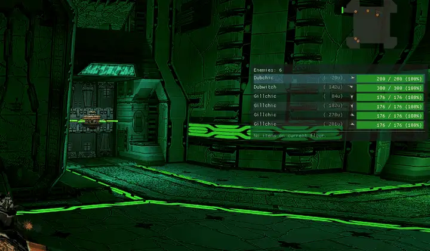
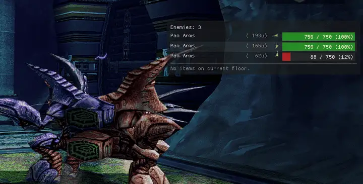
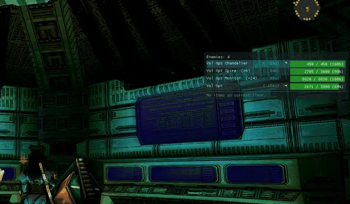
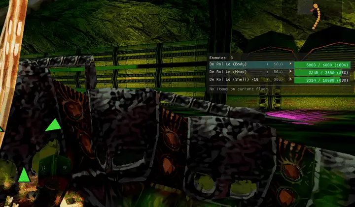
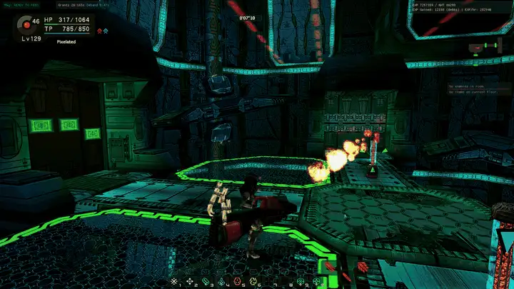
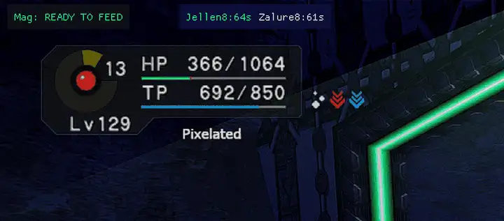
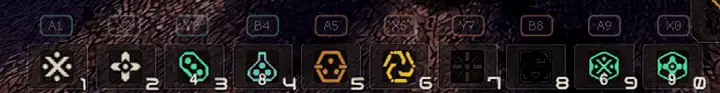

# Pixelated's PSOBB Mods

A ReShade add-on for Phantasy Star Online Blue Burst.

Memory-read only. No binary patches, no network packets. The only
write path is `SendInput` keyboard events for the optional controller
chord remapper.



---

## Features

The HUD is split across several independently-anchored windows so you
can lay each one out where it doesn't collide with the game's native
UI.

### Monster HP panel

Live name + HP + colour-coded bar for every enemy in the current
room. Targeted enemy highlights cyan and pins to the top. Distance
and a compass arrow pointing to the enemy are shown per row.

Special handling for bosses that don't play nice with the generic
enemy panel:

- De Rol Le / Barba Ray: real body + shell HP with pinned max.
- Vol Opt: phase 1 sub-parts disambiguated into individual rows
  (Body, Chandelier, Monitor, Panel, Spire); phase 2 collapses
  into a single aggregate `(×N)` row.
- Dark Falz: tracks the real active body across phases 1/2/3.
- Pan Arms: shows only the active form — combined, or Hidoom +
  Migium after split, never both.





### Floor items panel

Closest-first sort with live distance. Three filter modes (Notable
/ All / Gear only), per-tool-subtype toggles, a tech-disk minimum
level slider, a yellow "new drop" flash, and a red pulse on rare
item IDs.

Three scopes chosen independently:

- **Global** — everything on the ship.
- **Nearby** — distance-capped; self-declutters as you walk.
- **Room** — only the current floor.

All item, tech, and weapon-special names are read from the game's
own tables at runtime, so they follow the game's locale and
automatically pick up new items without a data-file update.

Curated hide list for base-tier drops, with stat-based overrides so
a notable roll (a Hard Shield `[+20 DFP +15 EVP]`) still shows.

### Status vignette

Pulsing screen-edge tint for nine negative-state conditions, each
with its own colour. When multiple fire at once the vignette
alternates between them so every active effect is visible.

- Low HP, Poison, Paralysis, Frozen, Shocked, Slow, Confused,
  Jellen, Zalure.

Intensity, pulse rate, edge thickness, and per-condition toggles
are all in the config panel.



### EXP tracker window

Current level, EXP to next level, session gained with a timer, and
a rolling EXP / hour rate. Width-locked top-right by default.

### Mag feed timer

Countdown to the next mag sync tick, pulses green when it's time
to feed. Separate top-left window above the game HP bar.

### Buff panel

Live Shifta / Deband / Jellen / Zalure timers with level display
and matching colours. Optional Shifta and Deband **reminders**:
with a reminder on and the buff down, the window background pulses
the buff's colour until you cast it. Both down → alternates.



### Low HP audible alert

On the safe → danger edge transition, plays
`pixelated_mods_alert.wav` from the add-on directory (or the
Windows warning chime if absent). Threshold configurable 5–90%.
Drop in your own `.wav` to customize the sound.

### Controller chord remapper

PSO's native Pad Button Config only exposes 5 of the 10 action
palette slots. The chord remapper gives controller players access
to all of them by holding a trigger modifier and tapping a face
button:

| Modifier | A | X | Y | B |
|---|---|---|---|---|
| LT | 1 | 2 | 3 | 4 |
| RT | 5 | 6 | 7 | 8 |
| LT + RT | 9 | 0 | – | – |

Adding **RB** on any of the above swaps to palette set 2 (Ctrl +
digit in game terms).

A **chord overlay** draws live badges above the palette bar
showing which face button triggers which slot under the currently
held modifier. Per-slot X-offset nudge lets you align the badges
against a custom HUD.



### Right-stick camera zoom

Since the game doesn't use the right stick, the Y axis maps to the
mouse wheel for camera zoom. The X axis is user-bindable via two
scancode fields in the config panel — unbound by default.

Axis-dominance filter so an angled push doesn't fire both at once.
Configurable deadzone, rate limit, and Y-axis invert.

### Mouse wheel rate limiter

Fixes the "runaway zoom" trackpad users see in PSO, where a
two-finger scroll keeps zooming for seconds after you stop. Works
for touchpads and some gaming mice.

---

## Configuration

Every setting is in the add-on's ReShade overlay panel. Changes
persist to `pixelated_mods.ini` automatically; the runtime log is
`pixelated_mods.log`.


---

## Installation

Grab `pixelateds-psobb-mods-<ver>.zip` from the
[Releases](../../releases) page. Drop-in for an existing ReShade
install — no bundled ReShade, no installer.

1. **ReShade 6.7.3+ with full add-on support** from
   [reshade.me](https://reshade.me). Use the "with full add-on
   support" variant (second button); the standard build silently
   ignores `.addon32` files. Point its installer at `PsoBB.exe` and
   pick Direct3D 9 for most PSOBB setups (including dgVoodoo,
   d3d8to9, and DXVK). Skip the effects pack.

2. Extract the zip next to `PsoBB.exe`:

   - `pixelated_mods.addon32` — the add-on DLL
   - `pixelated_mods_rares.txt` — rare ID list (drives the red
     pulse highlight)
   - `pixelated_mods_hidden.txt` — floor-item hide list
   - `pixelated_mods_monster_hidden.txt` — monster hide list
   - `pixelated_mods_alert.wav` — *optional*. Low-HP chime.

3. Launch PSOBB, press **Home**, open the **Add-ons** tab, confirm
   "Pixelated's PSOBB Mods" is listed.

**Uninstall:** delete those files. ReShade itself is separate.

---

## Why a ReShade add-on instead of BBMod

I run PSOBB under DXVK on a laptop where native Direct3D crashes
on external-monitor plug / unplug, and I already had ReShade in my
stack for HD textures. ReShade supports Vulkan as a first-class
backend so an add-on drawn through ReShade renders cleanly with no
translation chain.

**The two can coexist** — BBMod owns the `dinput8.dll` file slot,
this add-on hooks from inside ReShade. Run both if you want.

---

## Building from source

Requires Visual Studio 2025 with the "Desktop development with
C++" workload. PSOBB is 32-bit, so the add-on must be built x86.

```bat
build.bat
```

Output: `build/pixelated_mods.addon32`. Self-contained `/MT` static
CRT — no VC++ redistributable needed on the user's machine. All
dependencies (MinHook, ReShade SDK, Dear ImGui, nlohmann/json) are
vendored under `deps/`.

---

## Credits

- **[Solybum](https://github.com/Solybum)** —
  [PSOBBMod-Addons](https://github.com/Solybum/PSOBBMod-Addons) /
  solylib, source of almost every memory offset this add-on reads.
- **[jakeprobst](https://github.com/jakeprobst)** —
  [Drop Checker](https://github.com/jakeprobst/psodropcheckaddon),
  source of the drop-table walk logic.
- **[HybridEidolon](https://github.com/HybridEidolon)** — original
  author of [BBMod](https://github.com/HybridEidolon/psobbaddonplugin).

Third-party libraries under `deps/`:

- [MinHook](https://github.com/TsudaKageyu/minhook) (BSD-2)
- [ReShade](https://github.com/crosire/reshade) add-on SDK (BSD-3)
- [Dear ImGui](https://github.com/ocornut/imgui) (MIT)
- [nlohmann/json](https://github.com/nlohmann/json) (MIT)

---

## License

MIT — see [LICENSE](LICENSE). Third-party code under `deps/`
retains its original license.
