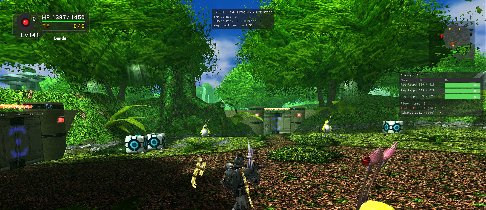
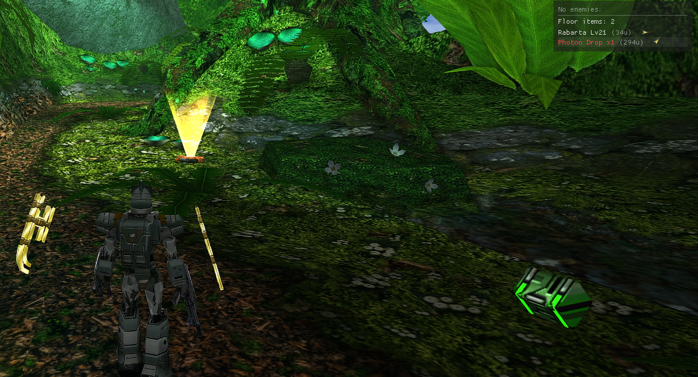
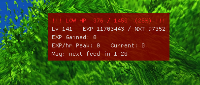
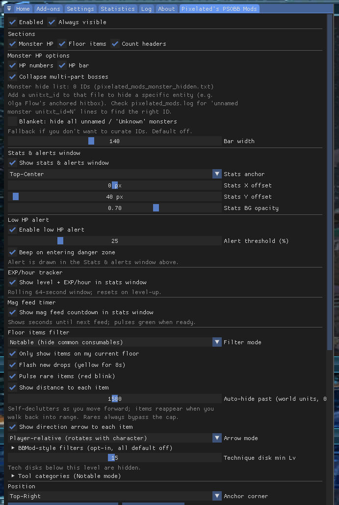

# Pixelated's PSOBB Mods

A ReShade add-on for PSOBB. Tested on
[Ephinea](https://ephinea.pioneer2.net/); *should* work on Schthack,
Ragol, and vanilla Blue Burst (not verified — sigscan targets
universal Blue Burst offsets).

Memory-read only. Does not modify the game binary, does not patch
memory, does not touch network packets. The only write path is
`SendInput` keyboard events for the optional controller chord
remapper, which is exactly what AutoHotkey does.



---

## Features

**Main HUD window** — monster HP + floor items, anchorable:

- **Monster HP panel** — name, HP, and a colour-coded bar for every
  alive enemy in your current room. Targeted monster highlights cyan.
  Structurally broken sub-entities (Olga Flow anchor, `unitxt_id==0`
  hitboxes, stale cutscene corpses) filtered automatically. Multi-part
  bosses (Vol Opt ver.2, Barba Ray, Gol Dragon, Saint-Milion,
  Shambertin, Kondrieu) collapse into a single `(×N)` aggregate row
  so Vol Opt's 28 parts don't fill the panel.
- **Floor items panel** — closest-first sort with live distance,
  filter modes (Notable / All / Gear only), per-sub-type tool
  toggles, tech disk min-level slider, current-floor filter, distance
  auto-hide, yellow "new drop" flash, and a red pulse on rare IDs
  matched against `pixelated_mods_rares.txt` (~350 entries). Curated
  hide list (`pixelated_mods_hidden.txt`, ~135 base-tier IDs) with
  stat-based overrides — a Hard Shield `[+20 DFP +15 EVP]` still
  shows even though plain Hard Shields are hidden.



**Stats & alerts window** — independently anchored, default top-center:

- **Low HP alert** — pulses red and plays an audible chime (bundled
  fallback or user-provided `pixelated_mods_alert.wav`) on the
  safe→danger edge transition. Threshold configurable 5–90%.



- **EXP / XP-per-hour tracker** — level, cumulative EXP, `NXT` to
  next level, session-gained, and three rates on one line:
  **Current** (60 s trailing, responsive to what you're doing right
  now), **Predicted** (60 min trailing, where the hour is heading),
  **Best Hour** (highest Predicted rate ever observed once the long
  ring has 55 min of data — a single big kill can't spike it).
  Renders as:

  ```
  Lv 142   EXP 11425485 / NXT 375310
  Total EXP Gained This Session: 2837415
  EXP/hr Current: 1234567 | Predicted: 987654 | Best Hour: 1012445
  ```
- **Mag feed timer** — countdown to the next sync tick, pulses green
  when you can feed.

**Controller chord remapper** (no overlay surface needed):

- **LT / RT + A / B / X / Y** → palette slots **1–8**
- **LT + RT + A / B** → palette slots **9 / 10**
- **RB** modifier on any of the above → slots **11–20** (sends
  `Ctrl + digit`)

Gives controller players access to all 20 action-palette slots. PSO's
in-game Pad Button Config exposes only 5. Not available in BBMod or
any Ephinea addon today.

---

## Installation

Grab `pixelateds-psobb-mods-<ver>.zip` from the
[Releases](../../releases) page (~275 KB). No installer, no bundled
ReShade — this is a drop-in for a ReShade install you already have.

**Prerequisites:**

1. PSOBB (see compatibility note above).
2. **ReShade 6.7.3+ with full add-on support** from
   [reshade.me](https://reshade.me). The standard ReShade download
   silently ignores `.addon32` files — use the "with full add-on
   support" variant (second button on the same page). Point its
   installer at `PsoBB.exe` and pick whichever API matches your
   actual renderer. For the vast majority of PSOBB setups that's
   **Direct3D 9** — it's the correct choice for Ephinea's default
   stack and anything running through `d3d8to9`, dgVoodoo, or
   DXVK's `dxvk_d3d9.dll`. If you're on a non-standard path (a
   Vulkan wrapper you configured yourself, a D3D11/12 rewrite,
   etc.) pick what actually matches. Skip the effects pack.

**Drop-in:**

Extract the zip and copy these files next to `PsoBB.exe`:

- `pixelated_mods.addon32` — the add-on DLL
- `pixelated_mods_items.txt`, `_techs.txt`, `_specials.txt` —
  item / tech / special name tables (from Drop Checker)
- `pixelated_mods_rares.txt` — rare ID list
- `pixelated_mods_hidden.txt` — hide list
- `pixelated_mods_monster_hidden.txt` — monster `unitxt_id` hide list
- `pixelated_mods_alert.wav` — *optional*. Low-HP chime. If absent,
  falls back to the Windows warning ding.

Launch PSOBB through your launcher, press **Home**, open the
**Add-ons** tab, confirm "Pixelated's PSOBB Mods" is listed.

**Uninstall:** delete the files above. ReShade itself is a separate
job — use ReShade's own setup to undo that.

---

## Configuration



Everything persists to `pixelated_mods.ini` next to the DLL; the
add-on writes the file automatically when you change a setting.
Runtime log is `pixelated_mods.log` — append-only, captures session
info and an exception filter for crash reports.

---

## Why a ReShade add-on instead of BBMod

I run PSOBB under DXVK / Vulkan on a laptop where native Direct3D
crashes on external-monitor plug / unplug, and I already had ReShade
in my stack for HD textures and colour grading. ReShade supports
Vulkan as a first-class render backend, so an add-on drawn through
ReShade renders cleanly under DXVK with no translation chain.

**The two can coexist.** BBMod owns the `dinput8.dll` file slot; this
add-on uses MinHook inline trampolines on
`dinput8!DirectInput8Create` from inside the ReShade add-on. Hooks
chain, nothing conflicts — run both if you want.

Use this add-on if you want one or more of:

- A Vulkan-native overlay path (no D3D8 wrapper chain to survive)
- A single-DLL drop-in alongside your existing ReShade install
- The controller chord remapper (nothing else on Ephinea ships this)
- The boss-parts collapse in the monster HP panel
- The sustained-hour XP rate tracker

---

## Building from source

Requires Visual Studio 2022 with the "Desktop development with C++"
workload (for MSVC v143 + Windows SDK + CMake + Ninja). PSOBB is
32-bit, so the add-on must be built x86.

```bat
build.bat
```

Output: `build/pixelated_mods.addon32`. Self-contained — `/MT`
static CRT, no Visual C++ redistributable needed on the user's
machine. All dependencies (MinHook, ReShade SDK, Dear ImGui) are
vendored under `deps/`.

---

## Credits

- **[Solybum](https://github.com/Solybum)** —
  [PSOBBMod-Addons](https://github.com/Solybum/PSOBBMod-Addons) /
  solylib, source of almost every memory offset this add-on reads.
  The C++ memory reader mirrors solylib's approach one-for-one.
- **[jakeprobst](https://github.com/jakeprobst)** — Jake's
  [Drop Checker](https://github.com/jakeprobst/psodropcheckaddon),
  source of the drop-table walk logic and the
  `pixelated_mods_items.txt` / `_techs.txt` / `_specials.txt` data
  files.
- **[HybridEidolon](https://github.com/HybridEidolon)** — original
  author of [BBMod](https://github.com/HybridEidolon/psobbaddonplugin),
  who established the Ephinea addon-etiquette norms this project
  follows.
- **[Ephinea](https://ephinea.pioneer2.net/)** — runs a PSOBB server
  that welcomes quality-of-life addons.

Third-party libraries under `deps/`:

- [MinHook](https://github.com/TsudaKageyu/minhook) (BSD-2) — x86
  inline hooking
- [ReShade](https://github.com/crosire/reshade) add-on SDK headers
  (BSD-3)
- [Dear ImGui](https://github.com/ocornut/imgui) headers (MIT)

---

## License

MIT — see [LICENSE](LICENSE). Third-party code under `deps/` retains
its original license.
